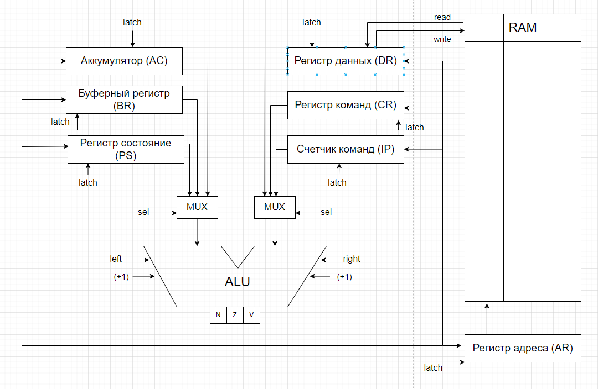

# Архитектура компьютера. Лабораторная работа №3

- P33311, Мозговая Лариса Андреевна.
- `alg | acc | neum | hw | instr | binary | stream | port | pstr | prob1 | [4]char`
- Без усложнения

### Пояснение варианта
- alg -- javascript-подобный язык
- acc -- все вычисления построены вокруг регистра ACC, выполняющего роль аккумулятора 
  - Инструкции -- изменяют значение, хранимое в аккумуляторе.
  - Ввод-вывод осуществляется через аккумулятор.
- neum -- команды и данные хранятся в общей памяти
- hw -- Control Unit -- hardwired. Реализуется как часть модели.
- instr -- каждая инструкция расписана потактово, но в журнале фиксируется только результат выполнения
- binary -- бинарное представление машинного кода.
  - Есть настоящие бинарные файлы, а не текстовые файлы с 0 и 1.
  - Есть отладочный вывод в текстовый файл вида:
  ```ebnf
  <address> - <HEXCODE> - <mnemonica>`
  `20 - 03340301 - add #01 <- 34 + #03`
  ```
- stream -- ввод-вывод реализован как поток токенов
- port -- передача данных в процессор реализовано через команды (IN, OUTC, OUT)
- pstr -- Length-prefixed (Pascal string)
- prob1 -- Алгоритм -- Multiples of 3 or 5. Project Euler. Problem 1

## Язык программирования

### Синтаксис

**Форма Бэкуса-Наура:**

```ebnf
<program> ::= <block_of_statements>
<block_of_statements> ::= <statement> <block_of_statements> | <statement>
<statement> ::= <print_statement> | <input_statement> | <if_statement> | <while_statement> 
	| <int_declaration> | <string_declaration> | <variable_assignment> | <comment_statement>

<print_statement> ::= "print" "(" <ident> "," "int" ")" <nl_block> 
	| "print" "(" <ident> "," "string" ")" <nl_block>
<input_statement> ::= "input" "(" <ident> ")" <nl_block>
<if_statement> ::= "if" "(" <comparison> ")" <nl_block> <block_of_statements> "endif" <nl_block>
<while_statement> ::= "while" "(" <comparison> ")" <nl_block> <block_of_statements> "endwhile" <nl_block>
<int_declaration> ::= "int" <ident> "=" <expression> <nl_block>
<string_declaration> ::= "string" <ident> "=" <word> <nl_block>
<variable_assignment> ::= <ident> "=" <expression> <nl_block> | <ident> "+=" <expression> <nl_block> 
  | <ident> "-=" <expression> <nl_block> | <ident> "/=" <expression> <nl_block>
  | <ident> "*=" <expression> <nl_block> | <ident> "%=" <expression> <nl_block>
<comment_statement> ::= "//" <word> <nl_block>

<nl_block> ::= <nl> <nl_block> | <nl>
<nl> ::= '\n'
<comparison> ::= <expression> | <expression> "==" <expression> | <expression> "!=" <expression> 
	| <expression> ">" <expression> | <expression> "<" <expression> 
	| <expression> ">=" <expression> | <expression> "<=" <expression>
<expression> ::= <term> | <term> "+" <term> | <term> "-" <term>
<term> ::= <unary> | <unary> "/" <unary> | <unary> "*" <unary> | <unary> "%" <unary>
<unary> ::= <primary> | "+"<primary> | "-"<primary>
<primary> ::= <number> | <ident>

<ident> ::= <letter> | <letter> <letter_or_digit_list>
<number> ::= <digit> | <digit_from_1> <digit_list>
<word> ::= <letter_or_digit_or_space> | <letter_or_digit_or_space> <word>

<letter_or_digit_list> ::= <letter_or_digit> | <letter_or_digit> <letter_or_digit_list>
<digit_list> ::= <digit> <digit_list> | <digit>
<letter_or_digit_or_space_list> ::= <letter_or_digit_or_space> 
	| <letter_or_digit_or_space> <letter_or_digit_or_space_list>

<letter_or_digit> ::= <letter> | <digit>
<letter_or_digit_or_space> ::= <letter> | <digit> | <space>
<space> ::= " " | "\t"
<letter> ::= [a-z] | [A-Z]
<digit> ::= [0-9]
<digit_from_1> ::= [1-9]
```

**Пояснения**
- Типы: `int`/`string`
- `if (comparison) ... endif`
- `while (comparison) ... endwhile`
- `print(variable, type)` = передает значение переменной в выходной буфер, type определяет как выводить переменную - интерпретируя данные как char или нет
- `input(variable)` = считывает значение из входного буфера в переменную
- Ветвления: >=, <=, ==, <, >, !=
- Математические операции: 
  - term + term
  - term - term
  - unary / unary
  - unary * unary
  - unary % unary
- Поддерживаются также обозначения положительных/отрицательных чисел как: +primary/-primary
- Поддерживаемые присваивания:
  - variable = expression
  - variable += expression
  - variable -= expression
  - variable /= expression
  - variable *= expression
  - variable %= expression
- Аргументами математических операций могут выступать литералы типа `int` и переменные типа `int`
- Поддерживаются только целые числа
- Поддерживаются комментарии в формате: // comment

**Пример**
```
//comment
int n = 0
input(n)
while (n > 0)
	print(n, string)
	input(n)
endwhile
```
**Семантика**

- Видимость данных -- глобальная
- Поддерживаются целочисленные литералы, находящиеся в диапазоне от $`-2^{31}`$ до $`2^{31}-1`$
- Поддерживаются строковые литералы, символы стоки необходимо заключить в кавычки
- Код выполняется последовательно

- Название переменной не может содержать цифры.
- Пустые строки игнорируются, количество пробелов в начале и конце строки не важно.
- Любой текст, расположенный после`//` трактуется как комментарий.

Память выделяется статически, при запуске модели.


## Организация памяти
Модель памяти процессора: 
- структура памяти однородная, запись на порт осуществляется посредством отдельных команд
- каждая инструкция занимает 1 машинное слово
- машинное слово - 32 бита, знаковое
- Память содержит `2^24` ячеек
- строки, объявленные пользователем распределяются по памяти один символ на ячейку

* Поддерживаются следующие **виды адресаций**:
    * **Прямая**: в качестве аргумента команды передается число, значение которого будет использовано как операнд.
      Например, команда `ld 30` обозначает, что в аккумулятор нужно записать число 30.
    * **Абсолютная**: в качестве аргумента команды передается адрес ячейки, значение в которой будет использовано как операнд.
      Например, если `mem[30] = 25`, то команда `ld 30` обозначает, что в аккумулятор нужно записать число 25.
    * **Косвенная**: в качестве аргумента команды передается адрес, по которому лежит адрес операнда.
      Например, если `mem[30] = 45`, `mem[45] = 49`, то команда `ld 30` также обозначает, что в аккумулятор нужно записать число 49.


* Существует несколько **регистров**:
    * Аккумулятор (AC): в него записываются результаты всех операций
    * Счетчик команд (IP): хранит адрес следующей выполняемой команды
    * Регистр данных (DR): хранит данные для записи в память и считывания из памяти
    * Регистр данных (CR): хранит код выполняемой команды
    * Регистр адреса (AR): хранит адрес последней ячейки в памяти, к которой было обращение
    * Регистр адреса (BR): используется для временного хранения данных
    * Регистр состояния (PS): хранит флаги NVC

## Система команд
Особенности процессора:

- Машинное слово -- `32` бита, знаковое.
- В качестве аргументов команды принимают `24` битные беззнаковые адреса

Каждая команда выполняется в несколько циклов:

1. Цикл выборки команды: по адресу из счетчика команд из памяти достается инструкция

- `IP -> BR, IP -> AR, mem[AR] -> DR, BR + 1 -> IP`

2. Цикл выборки операнда (для адресных команд): в регистр данных помещается адрес операнда, регистр данных передавется в
   регистр адреса, из памяти в регистр данных записывается значение операнда

- `DR -> AR, mem[AR] -> DR`

3. Цикл исполнения: совершаются действия, необходимые для выполнения команды. Результаты вычисления записываются в
   аккумулятор
4. Прерываний нет
5. Ввод-вывод - port-mapped. Осуществляется посредством взаимодействия IO с регистром ACC/с портами ввода-вывода

### Набор инструкций
<table>
	<tr>
		<td>Команда</td>
		<td>Кол-во тактов
          выполнения</td>
		<td>Адресная</td>
		<td>Описание</td>
	</tr>
	<tr>
		<td>ADD</td>
		<td>1</td>
		<td>
			+
		</td>
		<td>
			добавить значение из заданной ячейки к аккумулятору
		</td>
	</tr>
	<tr>
		<td>SUB</td>
		<td>1</td>
		<td>
			+
		</td>
		<td>
			вычесть значение из заданной ячейки из аккумулятора
		</td>
	</tr>
	<tr>
		<td>DIV</td>
		<td>1</td>
		<td>
			+
		</td>
		<td>
			разделить значение из аккумулятора на значение из заданной ячейки
		</td>
	</tr>
	<tr>
		<td>MUL</td>
		<td>1</td>
		<td>
			+
		</td>
		<td>
			умножить значение из аккумулятора на значение из заданной ячейки
		</td>
	</tr>
	<tr>
		<td>MOD</td>
		<td>1</td>
		<td>
			+
		</td>
		<td>
			взять остаток от деления значения из аккумулятора на значение из заданной ячейки
		</td>
	</tr>
	<tr>
		<td>CMP</td>
		<td>1</td>
		<td>
			+
		</td>
		<td>
			выставить флаги как результат вычитания заданной ячейки из аккумулятора, сохранить аккумулятор
		</td>
	</tr>
	<tr>
		<td>LOOP</td>
		<td>2-3</td>
		<td>
			+
		</td>
		<td>
			Если значение из заданной ячейки - 1 <= 0, тогда IP + 1 -> IP
		</td>
	</tr>
	<tr>
		<td>LD</td>
		<td>1</td>
		<td>
			+
		</td>
		<td>
			загрузить значение из заданной ячейки в аккамулятор
		</td>
	</tr>
	<tr>
		<td>ST</td>
		<td>3</td>
		<td>
			+
		</td>
		<td>
			загрузить значение в заданную ячейку
		</td>
	</tr>
	<tr>
		<td>JUMP</td>
		<td>1</td>
		<td>
			-
		</td>
		<td>
			перейти в заданную ячейку
		</td>
	</tr>
	<tr>
		<td>BEQ</td>
		<td>1</td>
		<td>
			-
		</td>
		<td>
			переход если z == 1
		</td>
	</tr>
	<tr>
		<td>BNE</td>
		<td>1</td>
		<td>
			-
		</td>
		<td>
			переход если z == 0
		</td>
	</tr>
	<tr>
		<td>BGE</td>
		<td>1</td>
		<td>
			-
		</td>
		<td>
			переход если n == 0
		</td>
	</tr>
	<tr>
		<td>BLE</td>
		<td>1</td>
		<td>
			-
		</td>
		<td>
			переход если z v n == 1
		</td>
	</tr>
	<tr>
		<td>BL</td>
		<td>1</td>
		<td>
			-
		</td>
		<td>
			переход если n == 1
		</td>
	</tr>
	<tr>
		<td>NOP</td>
		<td>0</td>
		<td>
			-
		</td>
		<td>
			Нет операции
		</td>
	</tr>
	<tr>
		<td>HLT</td>
		<td>0</td>
		<td>
			-
		</td>
		<td>
			Останов
		</td>
	</tr>
	<tr>
		<td>CLA</td>
		<td>1</td>
		<td>
			-
		</td>
		<td>
			очистить аккумулятор
		</td>
	</tr>
	<tr>
		<td>IN</td>
		<td>1</td>
		<td>
			-
		</td>
		<td>
			IO -> ACC
		</td>
	</tr>
	<tr>
		<td>OUTC</td>
		<td>1</td>
		<td>
			-
		</td>
		<td>
			chr(ACC) -> IO
		</td>
	</tr>
	<tr>
		<td>OUT</td>
		<td>1</td>
		<td>
			-
		</td>
		<td>
			ACC -> IO
		</td>
	</tr>
	<tr>
		<td>INC</td>
		<td>1</td>
		<td>
			-
		</td>
		<td>
			увеличить значение аккумулятора на один
		</td>
	</tr>
	<tr>
		<td>DEC</td>
		<td>1</td>
		<td>
			-
		</td>
		<td>
			уменьшить значение аккумулятора на один
		</td>
	</tr>
	<tr>
		<td>NEG</td>
		<td>1</td>
		<td>
			-
		</td>
		<td>
			изменить знак числа
		</td>
	</tr>
</table>

### Кодирование инструкций

- Машинный код сериализуется в бинарный вид.

## Транслятор

Интерфейс командной строки: `translator.py <input_file> <target_file>`

Реализовано в модуле: [translator](src/translator.py)

Этапы трансляции (функция `translate`):


1. Анализ кода с помощью Lexer'а:
    - разбор кода на токены
    - выявление ошибок
2. Парсинг токенов с помощью Parser'а в соответствии с BNF:
    - выявление ошибок
    - преобразование комбинаций токенов в последовательности из Term'ов
    - добавление/обновление необходимых переменных с запоминанием их адресов
    - после обработки исходного кода - соединение переменных и инструкций воедино (переподсчет адресов, замена названий аргументов на соответствующие адреса)
3. Генерация машинного бинарного кода


## Модель процессора

Интерфейс командной строки: `mashine.py <code_file> <input_file>`

Реализовано в модуле: [maсhine](src/machine.py).

### DataPath

Реализован в классе `DataPath`.



`memory` -- однопортовая память, поэтому либо читаем, либо пишем.
`registers`
Сигналы (реализованы в виде методов класса):

- `set_reg` -- защёлкнуть выбранное значение в регистре с указанным именем
- `read` --- считать данные из `mem[AR]` в регистр `DR`
- `write` --- записать данные из регистра `DR` в `mem[AR]`

В виде отдельного класса реализовано арифметико-логическое устройство (АЛУ)

- в данном классе реализован метод `alu_calculate`, принимающий аргументы с одного или двух входов и совершающий над ними
  арифметико-логическую операцию
- в результате выполнения операций устанавливаются следующие флаги
    - `Z` -- значение в аккумуляторе равно 0
    - `N` -- значение в аккумуляторе отрицательно
    - `V` -- произошло переполнение 

### ControlUnit

Реализован в классе `ControlUnit`.


- Метод `decode_and_execute_instruction` моделирует выполнение полного цикла инструкции (цикл выборки инструкции,
  операнда, исполнения)

Особенности работы модели:

- Цикл симуляции осуществляется в функции `simulation`.
- Шаг моделирования соответствует одной инструкции процессора с выводом состояния в журнал.
- Для журнала состояний процессора используется стандартный модуль `logging`.
- Количество инструкций для моделирования лимитировано.
- Остановка моделирования осуществляется при:
    - превышении лимита количества выполняемых инструкций;
    - если выполнена инструкция `hlt`.
    - CodeError = при возникновении рантайм-ошибок (деление на 0, слишком большая программа, слишком долгое исполнение и т.д.)
    - EOFException = ошибка, если буфер пустой


## Тестирование

Реализованные програмы

1. [hello world](src/examples/hello_world): вывести на экран строку `'Hello World!'`
2. [cat](src/examples/cat): программа `cat`, повторяем ввод на выводе.
3. [hello_username](src/examples/hello_user_name) -- программа `hello_user_name`: считывает имя пользователя и выводит на экран приветствие
4. [prob1](src/examples/prob1): найти сумму всех чисел, не превышающий `1 000`, которые кратны 3 или 5.

Интеграционные тесты реализованы тут [integration_test](./integration_test.py):

- через golden tests, конфигурация которых лежит в папке [golden](./golden)

CI:

``` yaml
lab3-lab3:
  stage: test
  image:
    name: ryukzak/python-tools
    entrypoint: [""]
  script:
    - cd src/brainfuck
    - poetry install
    - coverage run -m pytest --verbose
    - find . -type f -name "*.py" | xargs -t coverage report
    - ruff format --check .
```

где:

- `ryukzak/python-tools` -- docker образ, который содержит все необходимые для проверки утилиты.
  Подробнее: [Dockerfile](/src/brailfuck/Dockerfile)
- `poetry` -- управления зависимостями для языка программирования Python.
- `coverage` -- формирование отчёта об уровне покрытия исходного кода.
- `pytest` -- утилита для запуска тестов.
- `ruff` -- утилита для форматирования и проверки стиля кодирования.

Пример использования и журнал работы процессора на примере `cat`:

Пример использования для моего языка:

```shell
$ ./translator.py examples/cat examples/instr/cat
$ ./machine.py examples/instr/cat examples/foo_input

```

Выводится листинг всех регистров.

- Значения всех регистров, кроме PS выводятся в десятичном формате
- В качестве значения регистра `CR`выводятся имя команды, адрес и режим адресации
- Если в какой-то регистр записан символ, в листинге выводится его код

Также в лог выводятся события вида `INPUT symbol` и `OUTPUT symbol`

``` shell
$ cat examples/foo_input
foo
$ cat examples/cat      
// Cat
int n = 0
input(n)
while (n > 0)
        print(n, string)
        input(n)
endwhile
$ python translator.py examples\cat examples\instr\cat    
source LoC: 7  code instr: 18

$ python machine.py examples\instr\cat examples\foo_input            
INFO    machine:__print__     INSTR:    1 | AC    0 | BR    0 | IP:    1 | AR:    0 | PS: 010   | DR:              0 |  CR: DATA 0 NO_ADDRESS     |
INFO    machine:__print__     INSTR:    2 | AC    0 | BR    1 | IP:    2 | AR:    1 | PS: 010   | DR:              0 |  CR: DATA 0 NO_ADDRESS     |
INFO    machine:__print__     INSTR:    3 | AC    0 | BR    2 | IP:    3 | AR:    2 | PS: 010   | DR:              0 |  CR: DATA 0 NO_ADDRESS     |
INFO    machine:decode_and_execute_instruction {info_buffer: ['f', 'o', 'o', '\x00'] >> 102}
INFO    machine:__print__     INSTR:    4 | AC  102 | BR    3 | IP:    4 | AR:    3 | PS: 010   | DR:     1409286144 |  CR: IN 0 NO_ADDRESS       |
INFO    machine:__print__     INSTR:    5 | AC  102 | BR    4 | IP:    5 | AR:    2 | PS: 000   | DR:            102 |  CR: ST 2 ABSOLUTE         |
INFO    machine:__print__     INSTR:    6 | AC  102 | BR    5 | IP:    6 | AR:    2 | PS: 000   | DR:            102 |  CR: LD 2 ABSOLUTE         |
INFO    machine:__print__     INSTR:    7 | AC  102 | BR    6 | IP:    7 | AR:    0 | PS: 000   | DR:            102 |  CR: ST 0 ABSOLUTE         |
INFO    machine:__print__     INSTR:    8 | AC    0 | BR    0 | IP:    8 | AR:    7 | PS: 010   | DR:              0 |  CR: LD 0 DIRECT           |
INFO    machine:__print__     INSTR:    9 | AC    0 | BR    8 | IP:    9 | AR:    1 | PS: 010   | DR:              0 |  CR: ST 1 ABSOLUTE         |
INFO    machine:__print__     INSTR:   10 | AC  102 | BR    9 | IP:   10 | AR:    0 | PS: 000   | DR:            102 |  CR: LD 0 ABSOLUTE         |
INFO    machine:__print__     INSTR:   11 | AC  102 | BR   10 | IP:   11 | AR:    1 | PS: 000   | DR:              0 |  CR: CMP 1 ABSOLUTE        |
INFO    machine:__print__     INSTR:   12 | AC  102 | BR   11 | IP:   12 | AR:   11 | PS: 000   | DR:      956301329 |  CR: BLE 17 DIRECT         |
INFO    machine:__print__     INSTR:   13 | AC  102 | BR   12 | IP:   13 | AR:    2 | PS: 000   | DR:            102 |  CR: LD 2 ABSOLUTE         |
INFO    machine:decode_and_execute_instruction {output_buffer: ['f'] << f}
INFO    machine:__print__     INSTR:   14 | AC  102 | BR   13 | IP:   14 | AR:   13 | PS: 000   | DR:     1476395008 |  CR: OUTC 0 NO_ADDRESS     |
INFO    machine:decode_and_execute_instruction {info_buffer: ['f', 'o', 'o', '\x00'] >> 111}
INFO    machine:__print__     INSTR:   15 | AC  111 | BR   14 | IP:   15 | AR:   14 | PS: 000   | DR:     1409286144 |  CR: IN 0 NO_ADDRESS       |
INFO    machine:__print__     INSTR:   16 | AC  111 | BR   15 | IP:   16 | AR:    2 | PS: 000   | DR:            111 |  CR: ST 2 ABSOLUTE         |
INFO    machine:__print__     INSTR:   17 | AC  111 | BR   16 | IP:    5 | AR:   16 | PS: 000   | DR:      687865861 |  CR: JUMP 5 DIRECT         |
INFO    machine:__print__     INSTR:   18 | AC  111 | BR    5 | IP:    6 | AR:    2 | PS: 000   | DR:            111 |  CR: LD 2 ABSOLUTE         |
INFO    machine:__print__     INSTR:   19 | AC  111 | BR    6 | IP:    7 | AR:    0 | PS: 000   | DR:            111 |  CR: ST 0 ABSOLUTE         |
INFO    machine:__print__     INSTR:   20 | AC    0 | BR    0 | IP:    8 | AR:    7 | PS: 010   | DR:              0 |  CR: LD 0 DIRECT           |
INFO    machine:__print__     INSTR:   21 | AC    0 | BR    8 | IP:    9 | AR:    1 | PS: 010   | DR:              0 |  CR: ST 1 ABSOLUTE         |
INFO    machine:__print__     INSTR:   22 | AC  111 | BR    9 | IP:   10 | AR:    0 | PS: 000   | DR:            111 |  CR: LD 0 ABSOLUTE         |
INFO    machine:__print__     INSTR:   23 | AC  111 | BR   10 | IP:   11 | AR:    1 | PS: 000   | DR:              0 |  CR: CMP 1 ABSOLUTE        |
INFO    machine:__print__     INSTR:   24 | AC  111 | BR   11 | IP:   12 | AR:   11 | PS: 000   | DR:      956301329 |  CR: BLE 17 DIRECT         |
INFO    machine:__print__     INSTR:   25 | AC  111 | BR   12 | IP:   13 | AR:    2 | PS: 000   | DR:            111 |  CR: LD 2 ABSOLUTE         |
INFO    machine:decode_and_execute_instruction {output_buffer: ['f', 'o'] << o}
INFO    machine:__print__     INSTR:   26 | AC  111 | BR   13 | IP:   14 | AR:   13 | PS: 000   | DR:     1476395008 |  CR: OUTC 0 NO_ADDRESS     |
INFO    machine:decode_and_execute_instruction {info_buffer: ['f', 'o', 'o', '\x00'] >> 111}
INFO    machine:__print__     INSTR:   27 | AC  111 | BR   14 | IP:   15 | AR:   14 | PS: 000   | DR:     1409286144 |  CR: IN 0 NO_ADDRESS       |
INFO    machine:__print__     INSTR:   28 | AC  111 | BR   15 | IP:   16 | AR:    2 | PS: 000   | DR:            111 |  CR: ST 2 ABSOLUTE         |
INFO    machine:__print__     INSTR:   29 | AC  111 | BR   16 | IP:    5 | AR:   16 | PS: 000   | DR:      687865861 |  CR: JUMP 5 DIRECT         |
INFO    machine:__print__     INSTR:   30 | AC  111 | BR    5 | IP:    6 | AR:    2 | PS: 000   | DR:            111 |  CR: LD 2 ABSOLUTE         |
INFO    machine:__print__     INSTR:   31 | AC  111 | BR    6 | IP:    7 | AR:    0 | PS: 000   | DR:            111 |  CR: ST 0 ABSOLUTE         |
INFO    machine:__print__     INSTR:   32 | AC    0 | BR    0 | IP:    8 | AR:    7 | PS: 010   | DR:              0 |  CR: LD 0 DIRECT           |
INFO    machine:__print__     INSTR:   33 | AC    0 | BR    8 | IP:    9 | AR:    1 | PS: 010   | DR:              0 |  CR: ST 1 ABSOLUTE         |
INFO    machine:__print__     INSTR:   34 | AC  111 | BR    9 | IP:   10 | AR:    0 | PS: 000   | DR:            111 |  CR: LD 0 ABSOLUTE         |
INFO    machine:__print__     INSTR:   35 | AC  111 | BR   10 | IP:   11 | AR:    1 | PS: 000   | DR:              0 |  CR: CMP 1 ABSOLUTE        |
INFO    machine:__print__     INSTR:   36 | AC  111 | BR   11 | IP:   12 | AR:   11 | PS: 000   | DR:      956301329 |  CR: BLE 17 DIRECT         |
INFO    machine:__print__     INSTR:   37 | AC  111 | BR   12 | IP:   13 | AR:    2 | PS: 000   | DR:            111 |  CR: LD 2 ABSOLUTE         |
INFO    machine:decode_and_execute_instruction {output_buffer: ['f', 'o', 'o'] << o}
INFO    machine:__print__     INSTR:   38 | AC  111 | BR   13 | IP:   14 | AR:   13 | PS: 000   | DR:     1476395008 |  CR: OUTC 0 NO_ADDRESS     |
INFO    machine:decode_and_execute_instruction {info_buffer: ['f', 'o', 'o', '\x00'] >> 0}
INFO    machine:__print__     INSTR:   39 | AC    0 | BR   14 | IP:   15 | AR:   14 | PS: 000   | DR:     1409286144 |  CR: IN 0 NO_ADDRESS       |
INFO    machine:__print__     INSTR:   40 | AC    0 | BR   15 | IP:   16 | AR:    2 | PS: 010   | DR:              0 |  CR: ST 2 ABSOLUTE         |
INFO    machine:__print__     INSTR:   41 | AC    0 | BR   16 | IP:    5 | AR:   16 | PS: 010   | DR:      687865861 |  CR: JUMP 5 DIRECT         |
INFO    machine:__print__     INSTR:   42 | AC    0 | BR    5 | IP:    6 | AR:    2 | PS: 010   | DR:              0 |  CR: LD 2 ABSOLUTE         |
INFO    machine:__print__     INSTR:   43 | AC    0 | BR    6 | IP:    7 | AR:    0 | PS: 010   | DR:              0 |  CR: ST 0 ABSOLUTE         |
INFO    machine:__print__     INSTR:   44 | AC    0 | BR    0 | IP:    8 | AR:    7 | PS: 010   | DR:              0 |  CR: LD 0 DIRECT           |
INFO    machine:__print__     INSTR:   45 | AC    0 | BR    8 | IP:    9 | AR:    1 | PS: 010   | DR:              0 |  CR: ST 1 ABSOLUTE         |
INFO    machine:__print__     INSTR:   46 | AC    0 | BR    9 | IP:   10 | AR:    0 | PS: 010   | DR:              0 |  CR: LD 0 ABSOLUTE         |
INFO    machine:__print__     INSTR:   47 | AC    0 | BR   10 | IP:   11 | AR:    1 | PS: 010   | DR:              0 |  CR: CMP 1 ABSOLUTE        |
INFO    machine:__print__     INSTR:   48 | AC    0 | BR   11 | IP:   17 | AR:   11 | PS: 010   | DR:      956301329 |  CR: BLE 17 DIRECT         |
Output: foo
Instructions: 48
Ticks: 251
```

Пример проверки исходного кода:

``` shell
$ poetry run pytest . -v --update-goldens
========================================================================================================= test session starts =========================================================================================================
platform win32 -- Python 3.11.8, pytest-7.4.4, pluggy-1.4.0 -- C:\Users\лара\Documents\Учеба\АК\pythonProject5\Scripts\python.exe
cachedir: .pytest_cache
rootdir: C:\Users\лара\Documents\Учеба\Сии\pythonProject5
configfile: pyproject.toml
plugins: golden-0.2.2
collected 4 items                                                                                                                                                                                                                      

src/integration_test.py::test_translator_and_machine[golden/cat.yml] PASSED                                                                                                                                                      [ 25%]
src/integration_test.py::test_translator_and_machine[golden/hello_user_name.yml] PASSED                                                                                                                                          [ 50%]
src/integration_test.py::test_translator_and_machine[golden/hello_world.yml] PASSED                                                                                                                                              [ 75%]
src/integration_test.py::test_translator_and_machine[golden/prob1.yml] PASSED                                                                                                                                                    [100%]

========================================================================================================= 4 passed in 14.37s ========================================================================================================== 
$ poetry run ruff format .
8 files left unchanged
```

```text
| ФИО                       | алг              | LoC | code байт| code инстр.| debug lines | инстр. | такт. | вариант                                                               |
| Мозговая Лариса Андреевна | hello_world      | 3   | 112      | 28         | 28          | 139    | 682   | alg | acc | neum | hw | instr | binary | stream | port | pstr | prob1 |
| Мозговая Лариса Андреевна | cat              | 7   | 72       | 18         | 18          | 48     | 251   | alg | acc | neum | hw | instr | binary | stream | port | pstr | prob1 |
| Мозговая Лариса Андреевна | hello_user_name  | 10  | 292      | 73         | 73          | 373    | 1852  | alg | acc | neum | hw | instr | binary | stream | port | pstr | prob1 |
| Мозговая Лариса Андреевна | prob1            | 19  | 392      | 98         | 98          | 44053  | 253976| alg | acc | neum | hw | instr | binary | stream | port | pstr | prob1 |


```